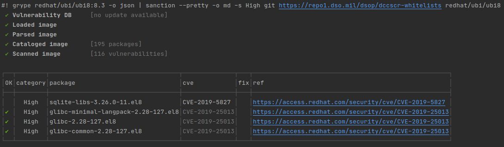

sanction
===
apply allowlist to [grype](https://github.com/anchore/grype) scans

### usage

```
sanction v0.1.0
Basic allowlisting and formatting for grype scans

USAGE:
    sanction [OPTIONS]

FLAGS:
    -h, --help       Prints help information
    -V, --version    Prints version information

OPTIONS:
    -l, --allowlist <allowlist>    Path to allowlist [default: allow.txt]
    -o, --output <output>          Output mode [default: remove]
    -s, --severity <severity>      Minimum severity
```




### intiial mvp
- [X] parse grype input
- [X] read allowlist
- [X] filter vulnerabilities
- [X] output markdown
- [ ] output grype schema
- [ ] apply tags to grype schema
